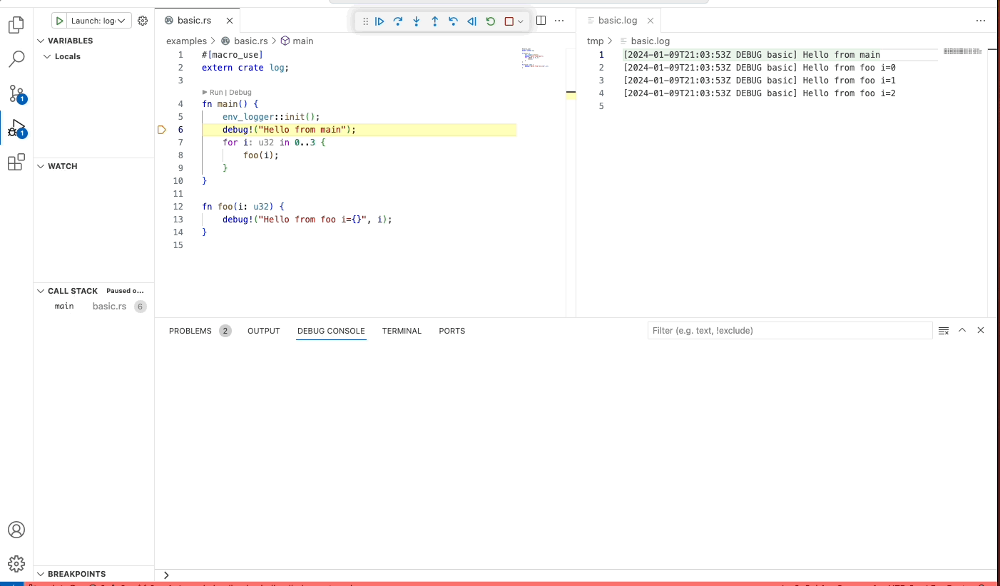

# log2src

Mapping logs to source code to augment debugging, analysis, and understanding.

## log2src-dbg: a log driven debugger

Use logs generated by your application to drive a debugger and step through the source code.

### Features
- Automates the step of mapping the log statements back to the source code easing the cognitive burden while debugging.
- Will try to deduce the value of variables included in the log statement.
- Infers the call stack when possible based on an analysis of the source code.

### Use cases
There are some types of applications and situations where connecting a traditional debugger is not fast, easy, or possible. Some of the use cases this tool is intended to help are:
1. Multi-threaded code: debuggers can impact the multi-threaded code as you're debugging it. Instead capture the issue once with logs and replay the situation deterministically to debug it.
2. Client server applications: stepping across multiple processes requires orchestrating multiple debuggers and racing against client time outs. Alternatively aggregate the client and server logs and debug at your own pace.
3. prod: trying to debug on prod is risky and requires access to the infrastructure. Handle the debugging locally and away from any infrastructure that may be impacted by debugging.
